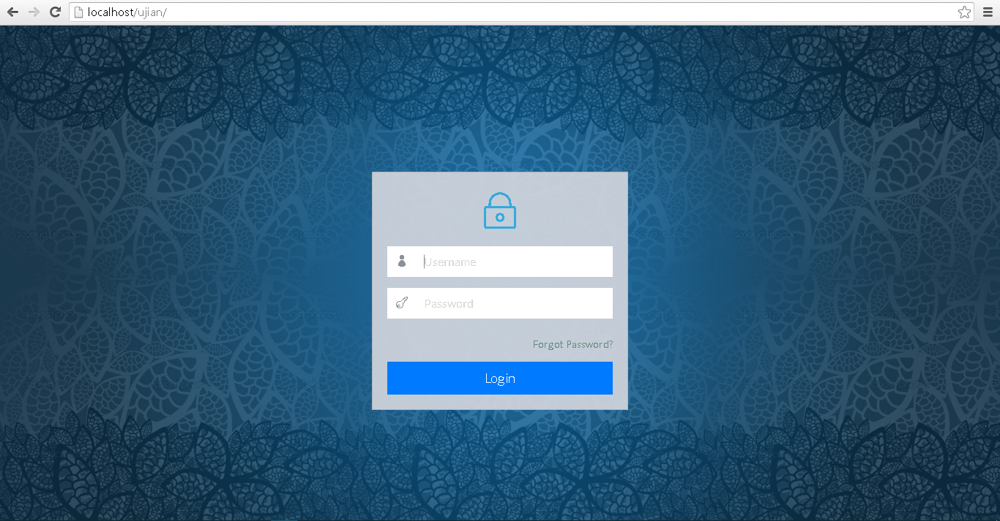
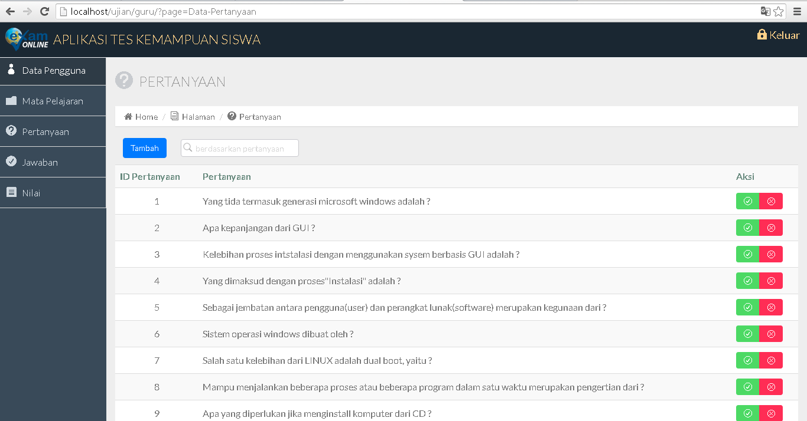
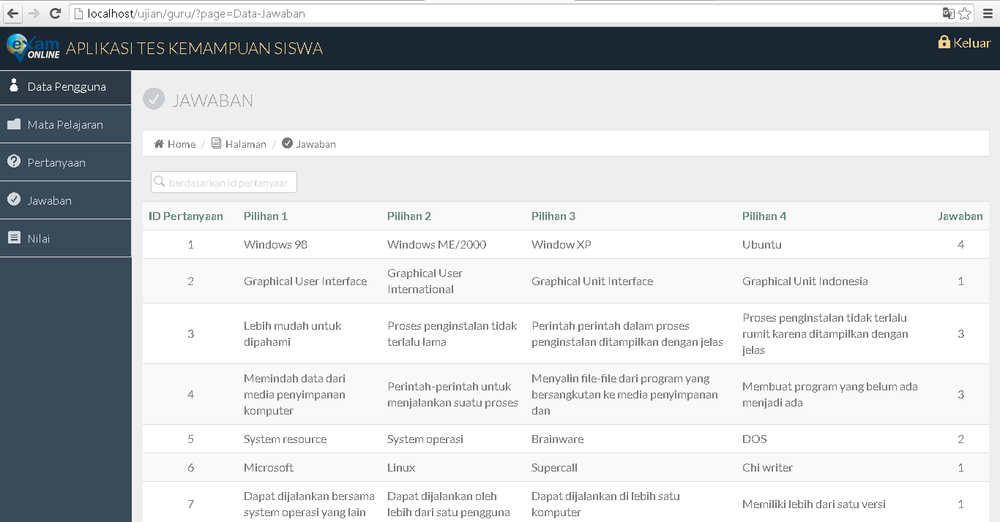
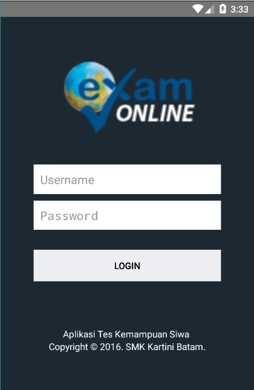
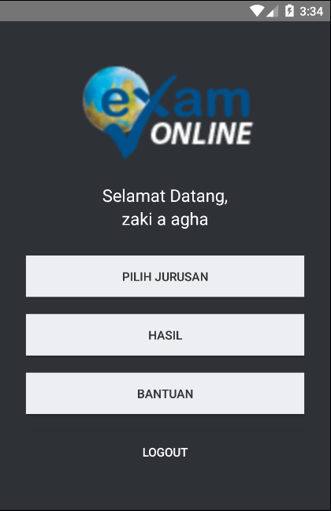
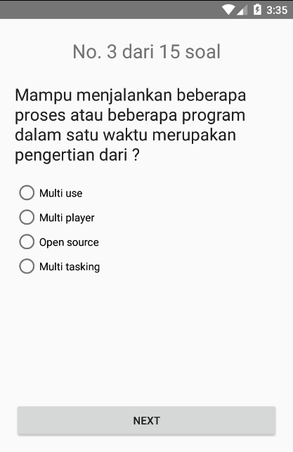
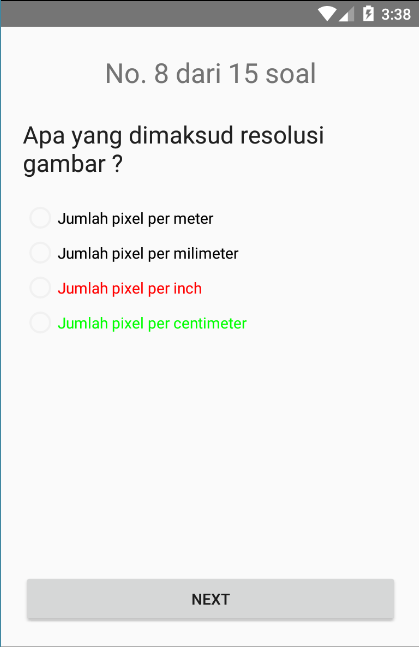
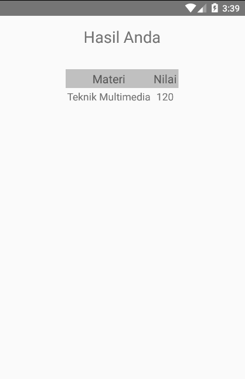
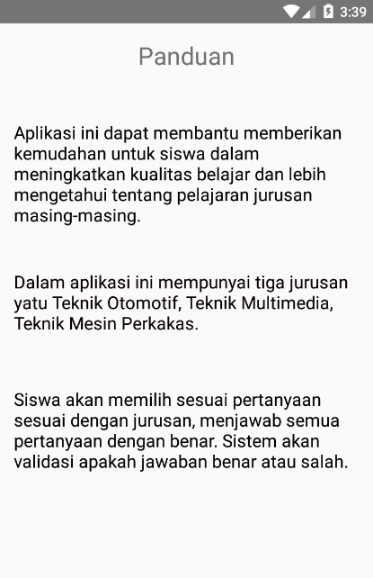

# TesOnline
Aplikasi digunakan untuk melakukan ujian online android dan web

<b>Admin WEB - Login</b>

<b>Admin WEB - Pertanyaan</b>

<b>Admin WEB - Jawaban</b>

<b>1. GUI Mobile - Login</b>

<b>2. GUI Mobile - Main</b>

<b>3. GUI Mobile - Pilih Jurusan</b>

<b>4. GUI Mobile - Soal Tes</b>

<b>5. GUI Mobile - Hasil Tes</b>

<b>6. GUI Mobile - Periksa Tes</b>

<b>7. GUI Mobile - Hasil</b>

<b>8. GUI Mobile - Panduan</b>

